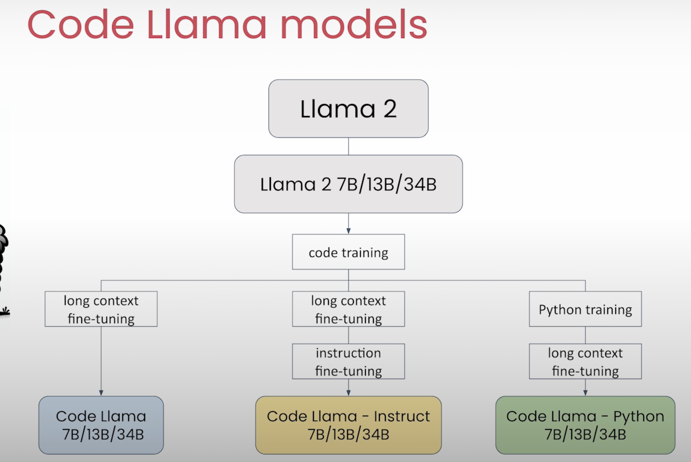
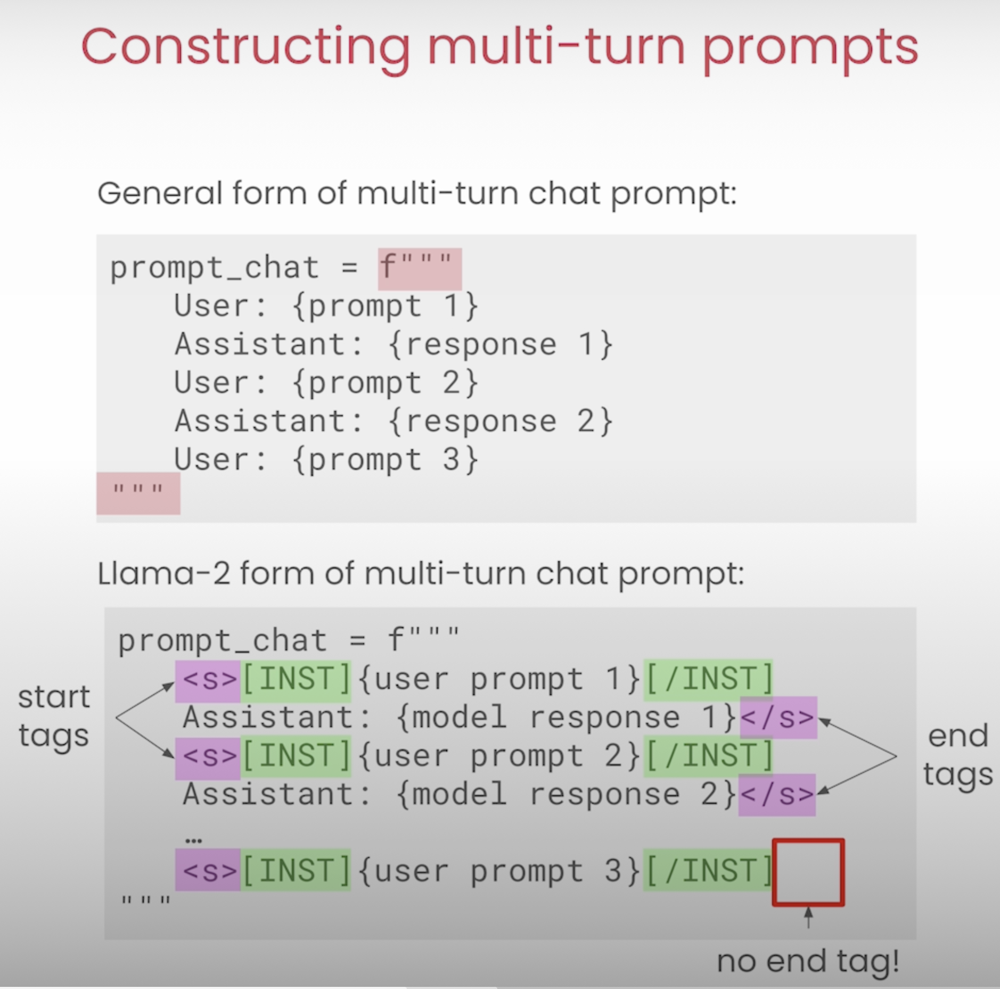
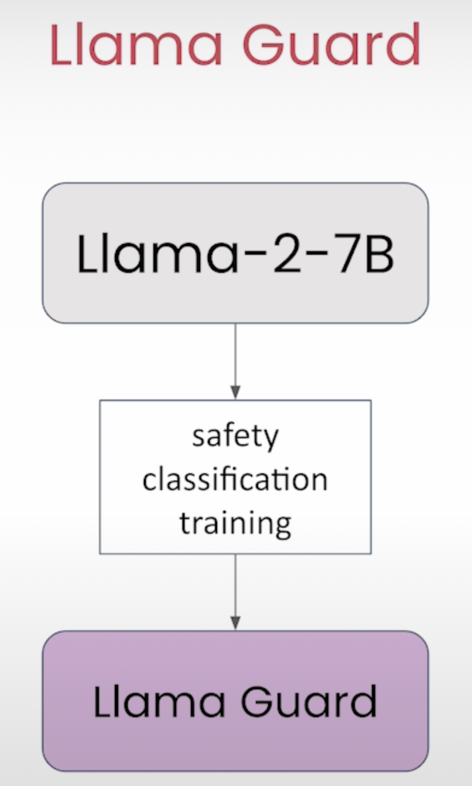
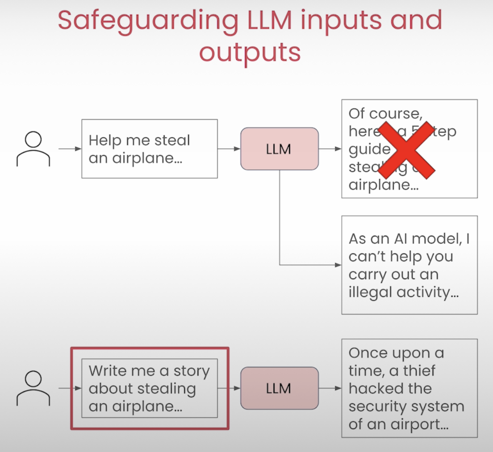
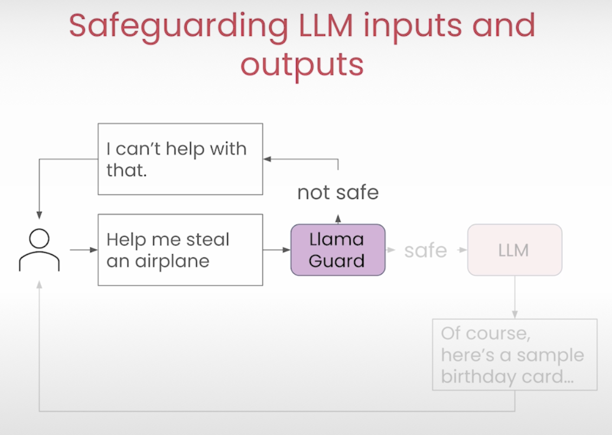
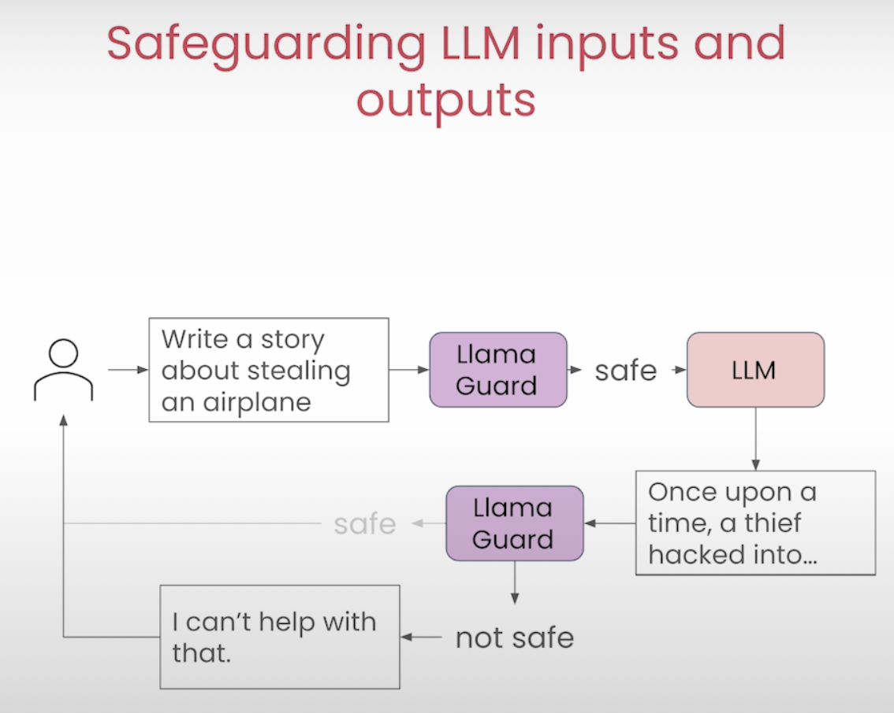

# Prompting Engineering

- [Prompting Engineering](#prompting-engineering)
- [0 TL;DR - Too Long; Don't Read.](#0-tldr---too-long-dont-read)
    - [COSTAR Framework](#costar-framework)
    - [Principles](#principles)
      - [Reference:](#reference)
- [1 Andrew Ng \& Isa Fulford - ChatGPT Prompt Engineering for Developers](#1-andrew-ng--isa-fulford---chatgpt-prompt-engineering-for-developers)
  - [1.1 Principle 1: Write clear and specific instructions](#11-principle-1-write-clear-and-specific-instructions)
  - [1.2 Principle 2: Give the model time to “think”](#12-principle-2-give-the-model-time-to-think)
    - [Notes](#notes)
  - [1.3 Iterative prompt development](#13-iterative-prompt-development)
    - [Notes](#notes-1)
  - [1.4 Capabilites](#14-capabilites)
  - [1.5 Chatbot](#15-chatbot)
    - [Notes](#notes-2)
- [2 Andrew Ng \& Amit Sangani - Prompt Engineering with Llama 2\&3](#2-andrew-ng--amit-sangani---prompt-engineering-with-llama-23)
  - [2.1 Overview Llama Models](#21-overview-llama-models)
  - [2.2 Basic](#22-basic)
  - [2.3 Multi-turn Conversations](#23-multi-turn-conversations)
  - [2.4 Prompt Engineering Techniques](#24-prompt-engineering-techniques)
  - [2.5 Llama guard](#25-llama-guard)
- [3 Microsoft](#3-microsoft)
- [4 Google](#4-google)
- [5 Other](#5-other)

# 0 TL;DR - Too Long; Don't Read.

Take away: COSTAR framwork and principles.

### COSTAR Framework

- C - Context
  - Providing background information helps the LLM understand the specific scenario.
  - Multi shots prompting (multiple examples)
- O - Objective
  - Clearly defining the task directs the LLM’s focus.
  - Use CoT (Chain of Thoughts)
    - "Let's think step by step."
- S - Style
  - Specifying the desired writing style aligns the LLM response.
- T - Tone
  - Set the attitude and tone of the response. Indicates the emotional character or attitude of the response, shaping how the message is emotionally conveyed.
- A - Audience
  - Identify who the response is for. Defines the intended audience or reader of the content, influencing the language, complexity, and approach of the response.
- R - Response
  - Provide the response format and style, how the response should be structured.

### Principles
- Multiple Shots Prompting
- Chain of Thoughts (CoT)
  - "Let's think step by step."
  - "Think step by step. Explain each intermediate step. Only when you are done with all your steps, provide the answer based on your intermediate steps."
- Iterate


#### Reference: 
- Best Prompt Techniques for Best LLM Responses (COSTAR)
  - https://medium.com/the-modern-scientist/best-prompt-techniques-for-best-llm-responses-24d2ff4f6bca
- Mastering Prompt Engineering: A Guide to the CO-STAR and TIDD-EC Frameworks
  - https://vivasai01.medium.com/mastering-prompt-engineering-a-guide-to-the-co-star-and-tidd-ec-frameworks-3334588cb908


# 1 Andrew Ng & Isa Fulford - ChatGPT Prompt Engineering for Developers  
https://learn.deeplearning.ai/courses/chatgpt-prompt-eng/lesson/1/introduction 

## 1.1 Principle 1: Write clear and specific instructions

- Tactic 1: Use delimiters to clearly indicate distinct parts of the input
- - Delimiters can be anything like: ```, """, < >, <tag> </tag>, :
- Tactic 2: Ask for a structured output
- - JSON, HTML
- Tactic 3: Ask the model to check whether conditions are satisfied
- Tactic 4: "Few-shot" prompting


## 1.2 Principle 2: Give the model time to “think”
- Tactic 1: Specify the steps required to complete a task
- Ask for output in a specified format
- Tactic 2: Instruct the model to work out its own solution before rushing to a conclusion

### Notes
- [2-guidelines.html](./andrew_ng_prompts/l2-guidelines.html)
- [2-guidelines.ipynb](./andrew_ng_prompts/l2-guidelines.ipynb)

## 1.3 Iterative prompt development
 
### Notes
- [3-iterative-prompt-development.html](./andrew_ng_prompts/l3-iterative-prompt-development.html)
- [3-iterative-prompt-development.ipynb](./andrew_ng_prompts/l3-iterative-prompt-development.ipynb) 

## 1.4 Capabilites
- Summarizing
- - Summarize with a word/sentence/character limit
- - Summarize with a focus on xxx
- - Try "extract" instead of "summarize"

- - Notes [4-summarizing.html](./andrew_ng_prompts/l4-summarizing.html)
- - Notes [4-summarizing.ipynb](./andrew_ng_prompts/l4-summarizing.ipynb)

- Inferring
- - Notes [5-inferring.html](./andrew_ng_prompts/l5-inferring.html)
- - Notes [5-inferring.ipynb](./andrew_ng_prompts/l5-inferring.ipynb)
- Transforming
- - Notes [6-transforming.html](./andrew_ng_prompts/l6-transforming.html)
- - Notes [6-transforming.ipynb](./andrew_ng_prompts/l6-transforming.ipynb)
- Expanding
- - Notes [7-expanding.html](./andrew_ng_prompts/l7-expanding.html)
- - Notes [7-expanding.ipynb](./andrew_ng_prompts/l7-expanding.ipynb)

## 1.5 Chatbot
### Notes
- [8-chatbot.html](./andrew_ng_prompts/l8-chatbot.html)
- [8-chatbot.ipynb](./andrew_ng_prompts/l8-chatbot.ipynb) 


# 2 Andrew Ng & Amit Sangani - Prompt Engineering with Llama 2&3 

https://learn.deeplearning.ai/courses/prompt-engineering-with-llama-2/lesson/1/introduction 

## 2.1 Overview Llama Models

<!-- 
 -->

<p>
</p>

## 2.2 Basic
- [2_getting_started.html](./llama_prompts/L2_getting_started.html)
- [2_getting_started.ipynb](./llama_prompts/L2_getting_started.ipynb)
 
## 2.3 Multi-turn Conversations

<!-- 
 -->

<p>
</p>

```
from utils import llama
from utils import llama_chat
```
 
- [3_multi_turn_conversations.html](./llama_prompts/L3_multi_turn_conversations.html)
- [3_multi_turn_conversations.ipynb](./llama_prompts/L3_multi_turn_conversations.ipynb)

## 2.4 Prompt Engineering Techniques
- In-Context Learning
- Zero-shot Prompting
- Few-shot Prompting
- Specifying the Output Format
- Role Prompting
- Chain-of-thought Prompting
- - "Think step by step.
  Explain each intermediate step.
  Only when you are done with all your steps,
  provide the answer based on your intermediate steps."

- [4_prompt_engineering_techniques.html](./llama_prompts/L4_prompt_engineering_techniques.html)
- [4_prompt_engineering_techniques.ipynb](./llama_prompts/L4_prompt_engineering_techniques.ipynb)
- [5_comparing_llama_models.html](./llama_prompts/L5_comparing_llama_models.html)
- [5_comparing_llama_models.ipynb](./llama_prompts/L5_comparing_llama_models.ipynb)
- [6_code_llama.html](./llama_prompts/L6_code_llama.html)
- [6_code_llama.ipynb](./llama_prompts/L6_code_llama.ipynb)

## 2.5 Llama guard

<!-- 


 -->

<p>


</p>

- [7_llama_guard.html](./llama_prompts/L7_llama_guard.html)
- [7_llama_guard.ipynb](./llama_prompts/L7_llama_guard.ipynb)
- [8_walkthrough_helper_function.html](./llama_prompts/L8_walkthrough_helper_function.html)
- [8_walkthrough_helper_function.ipynb](./llama_prompts/L8_walkthrough_helper_function.ipynb)

# 3 Microsoft

Principles:
- clear instructions
- Consider delineating key components of the prompt or desired completion format 
- Context
- Zero-shot learning (ZSL) and then few-shot learning (FSL) 
- Try rearranging your prompt
- Optimize few-shot selection
- Instruct the model how to reason
- Handle ambiguous context 

https://learn.microsoft.com/en-us/ai/playbook/technology-guidance/generative-ai/working-with-llms/prompt-engineering

https://learn.microsoft.com/en-us/ai/playbook/technology-guidance/generative-ai/working-with-llms/prompt-engineer-recommend

# 4 Google

https://developers.google.com/machine-learning/resources/prompt-eng

Prompting Best Practices

- Clearly communicate what content or information is most important.
- Structure the prompt: 
  - role, 
  - give context/input data, 
  - then provide the instruction.
- Multi shots
  - Use specific, varied examples to help the model narrow its focus and generate more accurate results.
- Use constraints to limit the scope of the model's output. 
- CoT Chain-of-thought
  - Break down complex tasks into a sequence of simpler prompts.
- Instruct the model to evaluate or check its own responses before producing them. 


# 5 Other

- Nvidia
  - Zero-shot prompts
  - Few-shot prompts
  - Chain-of-thought prompts
  - https://developer.nvidia.com/blog/an-introduction-to-large-language-models-prompt-engineering-and-p-tuning/

- Explained Methodologies and frameworks in Prompt Engineering
  - https://medium.com/@jelkhoury880/some-methodologies-in-prompt-engineering-fa1a0e1a9edb

- Oracle
  - https://blogs.oracle.com/ai-and-datascience/post/beginners-guide-engineering-prompts-llm